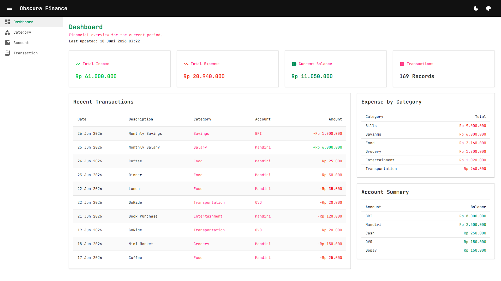
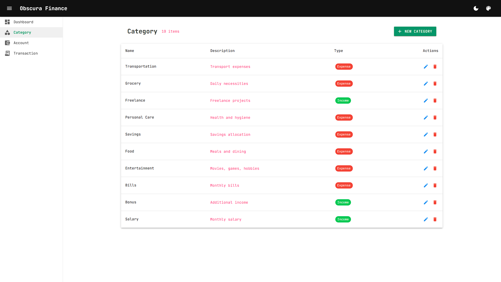
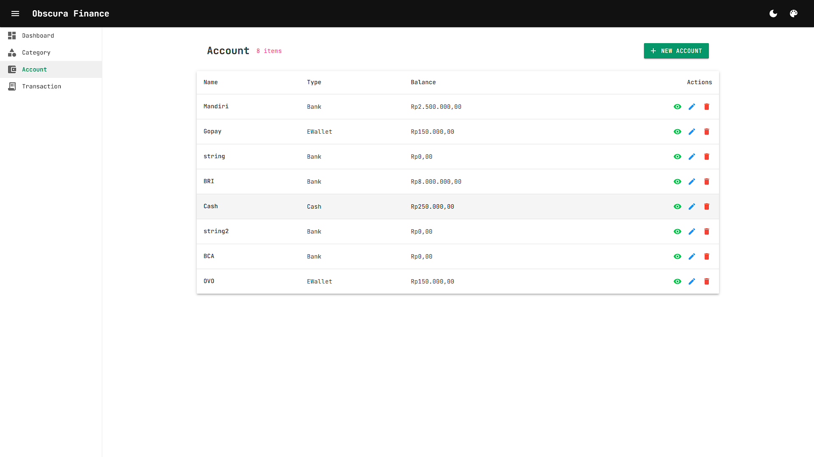
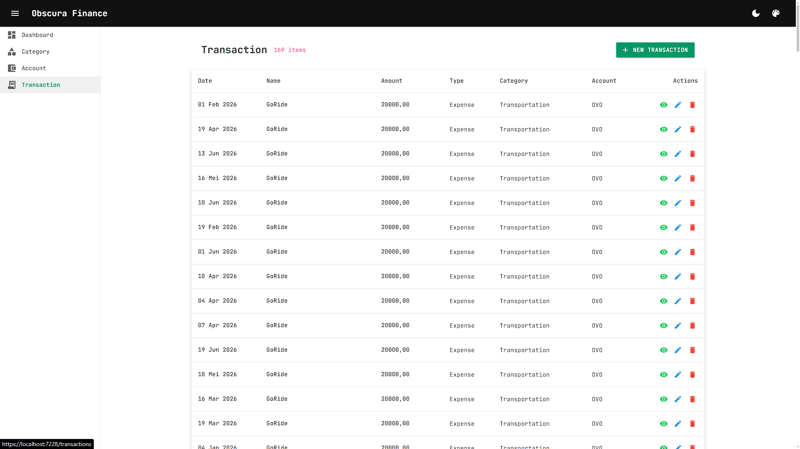

# Obscura Finance Tracker

Personal Finance Tracker built with ASP.NET Core, Blazor, EF Core, and SQL Server as a long-term learning project focused on enterprise software engineering.


---

## Latest Release

**v1.2.0 — Enterprise Foundation**

Completed:

* ✅ Interface Layer 
* ✅ Service Layer 
* ✅ Structured Logging 
* ✅ Global Exception Middleware 
* ✅ Response Standardization 
* ✅ Global Query Filter

This release establishes the enterprise foundation of the application and prepares the codebase for Repository Pattern, Unit Of Work, Validation, and CQRS. 

Current Development

* 🚧 Phase 3 — Data Access & Application Patterns

Current Module:
* 🚧 Module 14 — AutoMapper

Next Module:
* 🚧 Module 15 — Testing

Next Phase: 
* 🚧 Data Access Patterns (v1.5.0)
---

## Release History

| Version | Status   | Description            |
| ------- | -------- | ---------------------- |
| v1.2.0  | Latest   | Enterprise Foundation |
| v1.1.0  | Previous | Release Stabilization  |
| v1.0.0  | Previous | Usable Finance Tracker |


---

## 📖 Overview

Obscura Finance Tracker exists for two reasons:

1. Build a usable personal finance application.
2. Learn enterprise software engineering through a real project.

The application is the vehicle.

The learning journey is the destination.

---

## 🎯 Learning Objectives

This project is used to learn and practice:

* Clean Architecture
* Dependency Injection
* EF Core
* REST API Design
* Service Layer
* Repository Pattern
* Unit Of Work
* Validation
* AutoMapper
* Testing
* CQRS
* MediatR
* AI Integration
* Agentic Systems

---

## 🚀 Current Status

### 🏁 Completed

* Foundation 
* Category Management 
* Account Management 
* Transaction Management 
* Dashboard V1 
* Enterprise Foundation

### 🔄️ In Progress / Current Focus

* Module 14 AutoMapper

### 💡 Planned

* CQRS Architecture
* AI Integration
* Agentic AI
* DevOps & Deployment

---

## ✨ Features

| Feature                | Status |
| ---------------------- | ------ |
| Category Management    | ✅    |
| Account Management     | ✅    |
| Transaction Management | ✅    |
| Dashboard V1           | ✅    |
| Enterprise Foundation  | ✅    |
| Data Access Patterns   | 🚧    |
| CQRS                   | ⏳    |
| AI Integration         | ⏳    |

---

## 🛠 Tech Stack

| Area           | Technology                    |
| -------------- | ----------------------------- |
| Backend        | ASP.NET Core Web API          |
| Frontend       | Blazor Server                 |
| ORM            | Entity Framework Core 8       |
| Database       | SQL Server                    |
| Architecture   | Simplified Clean Architecture |
| SDK            | .NET 8 LTS                    |
| IDE            | Visual Studio 2022            |
| Source Control | Git                           |

---

## 🏗 Architecture

```text
08.Bsui
    ↓
07.Client
    ↓ ← HTTP/API
06.WebApi
    ↓
05.Infrastructure
    ↓
04.Application
    ↓
02.Domain
    ↓
01.Base
```

### 🏗️ Solution Structure

```text
src/
 ├── 01.Base            → Shared abstractions
 ├── 02.Domain          → Business entities
 ├── 03.Shared          → Common utilities
 ├── 04.Application     → Use cases and DTOs
 ├── 05.Infrastructure  → EF Core and persistence
 ├── 06.WebApi          → API endpoints
 ├── 07.Client          → API communication
 └── 08.Bsui            → User interface
```

---

## 🗺 Roadmap

| Phase                              | Status      |
| ---------------------------------- | ----------- |
| Phase 1 — Core Finance Application | ✅ Completed |
| Phase 2 — Enterprise Foundation    | ✅ Completed |
| Phase 3 — Data Access Patterns     | 🚧 Current   |
| Phase 4 — CQRS Architecture        | ⏳ Planned   |
| Phase 5 — AI Integration           | ⏳ Planned   |
| Phase 6 — Agentic AI               | ⏳ Planned   |
| Phase 7 — DevOps & Deployment      | ⏳ Planned   |

---

## 📚 Documentation

```text
docs/
├── 01-project-vision.md
├── 02-architecture.md
├── 03-learning-roadmap.md
├── 04-project-status.md
├── 05-working-agreement.md
├── 06-ai-roadmap.md
├── 07-git-workflow.md
├── known-issues.md
├── RoadmapGraph.md
└── adr/
```

---

## 🌱 Development Principles

* Focus on understanding software engineering deeply
* Learn before abstracting.
* Learn architecture incrementally
* Avoid premature abstraction
* Prioritize maintainability over complexity
* Refactor when understanding improves
* Mimic enterprise practices without unnecessary overhead

---

## 🔄 Git Workflow

```text
main
 └── develop
      └── feature/*
```

This project follows a simplified feature-branch workflow with Conventional Commits.

---

## 📈 Long-Term Evolution

```text
Finance Tracker
    ↓
Enterprise Patterns
    ↓
CQRS
    ↓
AI Integration
    ↓
Agentic AI
    ↓
Production Platform
```

---

## 🔮 Future Direction

### v1.3.0 — Data Access Patterns

* Repository Pattern
* Unit Of Work
* Validation
* AutoMapper
* Testing

### v1.4.0 — CQRS Architecture

* CQRS
* MediatR

Optionally add:

### Recently Completed — v1.2.0 Enterprise Foundation

* Interface Abstraction
* Service Layer
* Structured Logging
* Global Exception Middleware
* Standardized API Responses
* Global Query Filters

---

## 🎯 Final Objective

The ultimate goal of this project is not to build the perfect finance tracker.

The ultimate goal is to become a better enterprise .NET developer while building a useful real-world application.

---

## Screenshots

### Dashboard



### Categories



### Accounts



### Transactions

